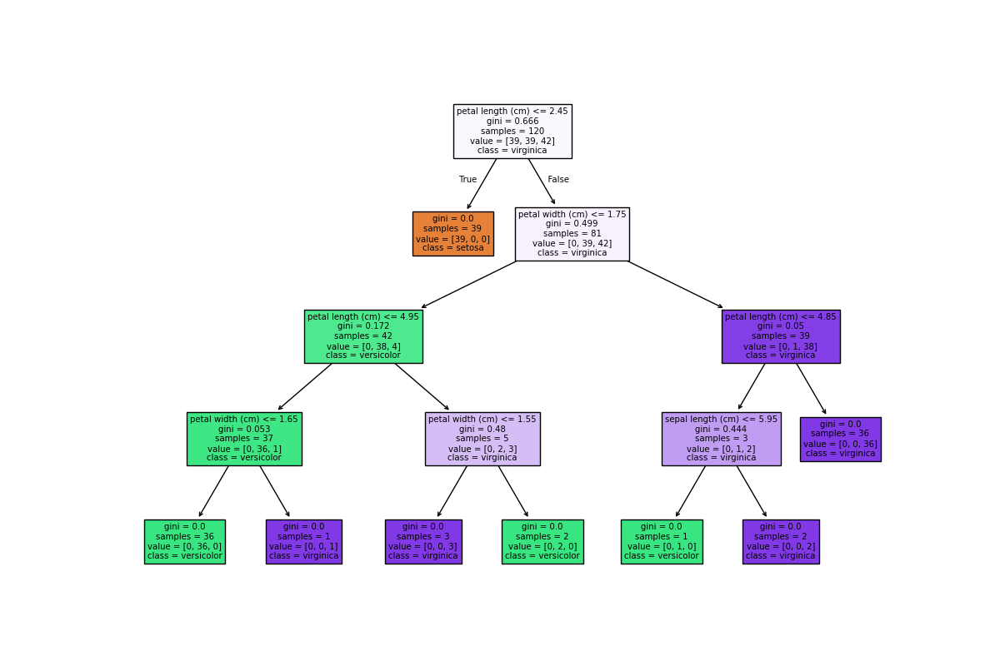
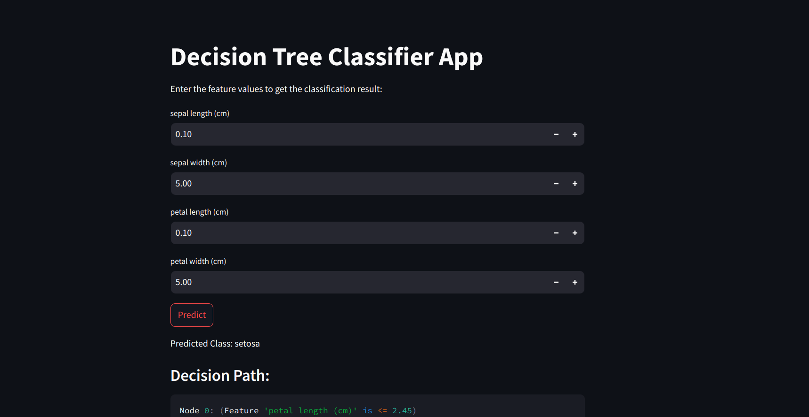

# Decision Tree Classifier

This repository contains an implementation of a decision classifier machine learning algorithm. The project includes a custom classifier that uses entropy and a Streamlit-based UI for interaction.

## Files

- `train_model.py`: Script to train the decision classifier model.
- `app.py`: Streamlit application to interact with the trained model.
- `requirements.txt`: File containing the required packages for the project.
- `custom_classifier.py`: Custom decision classifier implementation.

## Installation

1. Clone the repository:
    ```sh
    git clone <repository_url>
    cd <repository_directory>
    ```

2. Install the required packages:
    ```sh
    pip install -r requirements.txt
    ```

## Usage

1. Train the model by running:
    ```sh
    python train_model.py
    ```

2. Run the Streamlit application:
    ```sh
    streamlit run app.py
    ```

3. Open your browser and go to `http://localhost:8501` to interact with the application.

## Custom Classifier

The custom classifier implemented in this project uses entropy to make decisions. The details of the implementation can be found in the `custom_classifier.py` file.

## Results
How the result looks like 



streamlit looks like

